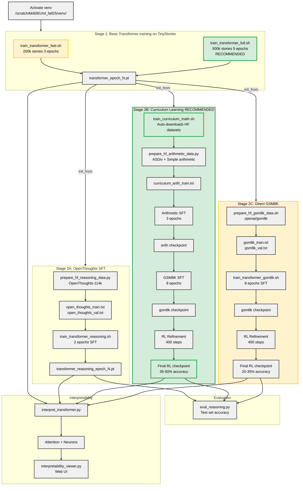

# pico-llm (Transformer-only extension)

Educational Transformer-only project:
- **Base training** on TinyStories subsets
- **Reasoning**: HF dataset export -> SFT finetune, plus **optional RL-style outcome post-training**
- **Interpretability** tooling inspired by Anthropic / Transformer Circuits

## Comprehensive flowchart



## Environment / constraints
- GPU: 2x GTX TITAN X (12GB). Default device: **`cuda:0`**
- Venv: `/scratch/kk6081/ml_fall25/venv/`
- Artifacts/checkpoints: **`/scratch/kk6081/picollm_extend/`**

## TL;DR (quick start commands)

### Recommended: Curriculum Learning for Best GSM8K Results ⭐

```bash
source /scratch/kk6081/ml_fall25/venv/bin/activate
cd /home/kk6081/pico_llm_extend/pico-llm

# 1) Train strong base transformer (500k stories, 5 epochs - 3-6 hours)
TINYSTORIES_SUBSET=500000 EPOCHS=5 bash scripts/train_transformer_full.sh

# 2) Curriculum learning: HuggingFace arithmetic → GSM8K (12-15 hours)
#    Auto-downloads ASDiv + simple arithmetic datasets
bash scripts/train_curriculum_math.sh

# 3) Evaluate
python scripts/eval_reasoning.py

# Expected: 35-50% GSM8K accuracy with MEDIUM model!
```

### Alternative: Direct Training Paths

```bash
# Fast base training (200k stories, 3 epochs - ~30 min)
bash scripts/train_transformer_fast.sh

# Option A: OpenThoughts reasoning (no RL)
bash scripts/train_transformer_reasoning.sh

# Option B: Direct GSM8K (8 epochs SFT + RL - 8-10 hours)
bash scripts/train_transformer_gsm8k.sh

# Interpretability analysis
python scripts/interpret_transformer.py --checkpoint /scratch/kk6081/picollm_extend/transformer_epoch1.pt \
  --analysis attention,logit_lens,neurons --out_dir /scratch/kk6081/picollm_extend/interpretability_base \
  --embed_size 512 --transformer_heads 8 --transformer_blocks 6 --ff_mult 4 --test_prompts "Once upon a time" --device cuda:0
```

**💡 Pro tip**: For better GSM8K results, see **[QUICK_FIX_GUIDE.md](QUICK_FIX_GUIDE.md)** for optimal training settings!

## 📚 Documentation & Training Guides

### Essential Reading
- **[QUICK_FIX_GUIDE.md](QUICK_FIX_GUIDE.md)** - Fix poor reasoning outputs (READ THIS FIRST!)
- **[HF_DATASETS_COMPLETE_GUIDE.md](HF_DATASETS_COMPLETE_GUIDE.md)** - Curriculum learning with HuggingFace ⭐NEW

### Advanced Guides
- **[HF_CURRICULUM_DATASETS.md](HF_CURRICULUM_DATASETS.md)** - Detailed dataset reference
- **[TRAINING_IMPROVEMENT_PLAN.md](TRAINING_IMPROVEMENT_PLAN.md)** - Performance optimization roadmap
- **[GRADIENT_NORMS_GUIDE.md](GRADIENT_NORMS_GUIDE.md)** - Understanding `grad_norm > 1` (it's normal!)
- **[TRAINING_DEFAULTS.md](TRAINING_DEFAULTS.md)** - Complete hyperparameter reference
- **[TRAINING_IMPROVEMENTS.md](TRAINING_IMPROVEMENTS.md)** - FP16, gradient accumulation, LLRD

### Visual Guides
- **[TRAINING_PATHS.txt](TRAINING_PATHS.txt)** - Visual comparison of training strategies
- **[HF_VS_CUSTOM_COMPARISON.txt](HF_VS_CUSTOM_COMPARISON.txt)** - HuggingFace vs custom data comparison

## 🎓 New: Curriculum Learning for Math Reasoning

**Why curriculum learning?** Teaching basic arithmetic before complex word problems improves GSM8K accuracy by 10-20%.

### What is Curriculum Learning?

Instead of jumping directly to GSM8K:
```
❌ Old: Base Model (200k×3) → GSM8K (3 epochs) = 7-10% accuracy
```

Use progressive difficulty:
```
✅ New: Base Model (500k×5) → Arithmetic (3 epochs) → GSM8K (8 epochs) = 35-50% accuracy
```

### Quick Start

```bash
# One command - does everything automatically!
bash scripts/train_curriculum_math.sh
```

**What it does:**
1. **Downloads HuggingFace datasets** (ASDiv elementary math, simple arithmetic)
2. **Arithmetic stage** (3 epochs): Learns basic operations + word problems
3. **GSM8K SFT stage** (8 epochs): Learns complex multi-step reasoning
4. **RL refinement** (400 steps): Improves answer selection via best-of-n sampling

**Datasets used (auto-downloaded):**
- **ASDiv**: 2,000 elementary school math problems (natural language word problems)
- **Simple Arithmetic**: 5,000 basic operations (addition, subtraction, multiplication)
- **GSM8K**: 7,324 complex reasoning problems (multi-step word problems)

See **[HF_DATASETS_COMPLETE_GUIDE.md](HF_DATASETS_COMPLETE_GUIDE.md)** for:
- Available datasets (ASDiv, MathQA, AQuA-RAT)
- Customization options
- Performance comparisons
- Troubleshooting

## 🚀 Quick Start: Apply Training Patches (RECOMMENDED)

**Before your first training run**, apply stability patches for 30-50% faster convergence:

```bash
# 1. Preview what will be changed (safe, no modifications)
python scripts/training_stability_patch.py --dry-run

# 2. Apply patches to pico-llm.py (creates backup automatically)
python scripts/training_stability_patch.py --apply

# 3. Train as normal - patches are now active!
bash scripts/train_transformer_fast.sh
```

**What gets patched**:
- ✅ **GPT-2 style weight initialization** - prevents exploding/vanishing gradients
- ✅ **Improved AdamW settings** - better convergence (beta2=0.95, weight_decay=0.1)
- ✅ **Gradient norm monitoring** - detect instability early (logs grad_norm in training)
- ✅ **Early stopping** - saves best checkpoint, stops if validation loss plateaus

**Verification**: After applying, your training logs will show:
```
[transformer] Epoch 1/3, Step 20/200 (global step: 20) Loss: 4.2341, Grad_norm: 2.156, LR: 1.50e-04
```

If you see `Grad_norm` and `LR` in logs → patches are active! ✅

**Rollback if needed**:
```bash
# Restore original (backup created automatically)
cp pico-llm.py.backup pico-llm.py
```

📖 **For advanced techniques** (mixed precision, gradient accumulation, LLRD), see: **[TRAINING_IMPROVEMENTS.md](TRAINING_IMPROVEMENTS.md)**

---

## Training

### Base Transformer (TinyStories)
- Fast dev: `bash scripts/train_transformer_fast.sh`
- Full run: `bash scripts/train_transformer_full.sh`

Scaling knobs (see `pico-llm.py`):
- `--transformer_size {small,medium}`
- `--tinystories_train_subset_size N`
- Faster training knobs: `--sample_interval_seconds`, `--sample_every_steps`, `--lr_schedule`, `--lr_warmup_steps`, `--lr_min_ratio`

If you hit OOM on 12GB:
- `BATCH=8` (or `4`) and/or `TRANSFORMER_SIZE=small`

### Training Parameters

Environment variables to control training (work with all training scripts):
```bash
# Model architecture
TRANSFORMER_SIZE=medium          # small (384d, 4h, 3b) or medium (512d, 8h, 6b)
TINYSTORIES_SUBSET=100000        # Number of TinyStories examples

# Training hyperparameters
BATCH=16                         # Batch size (reduce to 8 or 4 if OOM)
EPOCHS=3                         # Number of epochs
LR=2e-4                          # Learning rate
VAL_SPLIT=0.1                    # Validation split (0.1 = 10%)

# LR scheduling
LR_SCHEDULE=cosine               # none, cosine, or linear
LR_WARMUP_STEPS=500              # Warmup steps for stability
LR_MIN_RATIO=0.1                 # Min LR as fraction of base LR

# Sampling/logging
SAMPLE_EVERY_STEPS=100           # Generate text every N steps (0=time-based)
SAMPLE_INTERVAL_SECONDS=300      # Or every N seconds (if SAMPLE_EVERY_STEPS=0)
```

**Example**: Train medium model with larger batch
```bash
TRANSFORMER_SIZE=medium BATCH=32 LR=3e-4 bash scripts/train_transformer_fast.sh
```

### 🔧 Advanced: Manual Training Improvements

If you want more control beyond the automatic patch, see **[TRAINING_IMPROVEMENTS.md](TRAINING_IMPROVEMENTS.md)** for:
- **Gradient accumulation** - simulate larger batch sizes (effective batch = BATCH × ACCUM_STEPS)
- **Mixed precision training (FP16)** - 2x faster, 50% less memory
- **Layer-wise learning rate decay (LLRD)** - for finetuning only
- **Dropout strategies** - prevent overfitting
- **Curriculum learning** - start with easier examples
- **Troubleshooting guide** - fix loss explosions, plateaus, overfitting

## Reasoning: datasets + training

### A) OpenThoughts SFT (no RL)
Default: `open-thoughts/OpenThoughts-114k` -> exported to line-based text.

```bash
bash scripts/train_transformer_reasoning.sh
```

**Auto-selects base checkpoint**: Scripts automatically use the **latest epoch checkpoint** (highest epoch number) from `/scratch/kk6081/picollm_extend/transformer_epoch*.pt`. Override with `BASE_CKPT=/path/to/checkpoint.pt` if needed.

Outputs copied back as:
- `/scratch/kk6081/picollm_extend/transformer_reasoning_transformer_epoch*.pt`

### B) GSM8K with Curriculum Learning ⭐ RECOMMENDED

**Best approach for small models**: Use progressive difficulty training

```bash
# Full curriculum pipeline (automatic)
bash scripts/train_curriculum_math.sh
```

**What it does:**
1. Downloads HuggingFace datasets (ASDiv, simple arithmetic)
2. Trains on elementary math (3 epochs, 2-3 hours)
3. Trains on GSM8K reasoning (8 epochs SFT, 6-8 hours)
4. RL refinement (400 steps, 2-3 hours)

**Expected accuracy:** 35-50% with MEDIUM model (vs 7-10% without curriculum)

**Datasets used:**
- **ASDiv** (HuggingFace): 2k elementary school problems
- **Simple arithmetic**: 5k basic operations  
- **GSM8K**: 7.3k complex reasoning problems

See **[HF_DATASETS_COMPLETE_GUIDE.md](HF_DATASETS_COMPLETE_GUIDE.md)** for customization options.

---

### C) GSM8K Direct Training (No Curriculum)

If you want to skip curriculum learning (faster but lower accuracy):

Dataset:
- https://huggingface.co/datasets/openai/gsm8k (config `main`)

Prepare text files (optional; script auto-runs if missing):
- `bash scripts/prepare_hf_gsm8k_data.sh` -> writes `data/gsm8k_{train,val,test}.txt`

Train:
```bash
bash scripts/train_transformer_gsm8k.sh
```

**Auto-selects base checkpoint**: Scripts automatically use the **latest epoch checkpoint** (highest epoch number) from `/scratch/kk6081/picollm_extend/transformer_epoch*.pt`. Override with `BASE_CKPT=/path/to/checkpoint.pt` if needed.

**Default training:** 8 epochs SFT (~6-8 hours) + 400 steps RL (~2-3 hours) = **~8-11 hours total**

**Expected accuracy:** 20-35% with MEDIUM model (lower than curriculum approach)

---

### Training Approach Comparison

| Approach | Base Model | Training | Time | Expected Accuracy | Best For |
|----------|------------|----------|------|-------------------|----------|
| **Curriculum** ⭐ | 500k×5 | Arith(3ep) → GSM8K(8ep) + RL | 15-20h | **35-50%** | Production quality |
| **Direct GSM8K** | 500k×5 | GSM8K(8ep) + RL | 10-13h | 20-35% | Faster iteration |
| **Fast test** | 200k×3 | GSM8K(3ep) + RL | 3-4h | 7-15% | Quick debugging |
| **OpenThoughts** | 500k×5 | OpenThoughts(2ep) | 4-6h | 15-25% | Chain-of-thought |

**Recommendation:** Use **Curriculum Learning** for best results. Only skip it if time is very limited.

**Quick test mode** (for debugging):
```bash
EPOCHS=1 MAX_STEPS=500 RUN_RL=0 bash scripts/train_transformer_gsm8k.sh
```

Notes:
- Stage 1: SFT finetune (3 epochs, full dataset by default) → `transformer_gsm8k_transformer_epoch*.pt`
- Stage 2: RL-style outcome post-training (400 steps, batch=12, samples=8, **enabled** by default)
  - Disable via `RUN_RL=0`
  - Uses latest SFT checkpoint automatically
  - Output copied back as `/scratch/kk6081/picollm_extend/transformer_gsm8k_rl.pt`
- 📖 See **[TRAINING_DEFAULTS.md](TRAINING_DEFAULTS.md)** for parameter details and override examples

RL reading pointers:
- DeepSeek-R1: https://arxiv.org/abs/2501.12948
- Dr. Tulu draft: https://www.datocms-assets.com/64837/1763496622-dr_tulu_draft.pdf

### Reasoning evaluation
Heuristic numeric accuracy (works best with GSM8K / synthetic arithmetic):

```bash
python scripts/eval_reasoning.py \
  --checkpoint /scratch/kk6081/picollm_extend/transformer_gsm8k_transformer_epoch1.pt \
  --data data/gsm8k_test.txt
```

## Interpretability & analysis

Tool: `scripts/interpret_transformer.py` (attention heatmaps, logit lens, neuron max-activation contexts, patching stub).

### Web UI (browse saved results)

After you generate results with `interpret_transformer.py`, you can browse them with a lightweight local web UI:

```bash
python scripts/interpretability_viewer.py \
  --root /scratch/kk6081/picollm_extend/interpretability_test \
  --host 127.0.0.1 --port 8000
```

Then open: `http://127.0.0.1:8000/`

Transformer Circuits hub:
- https://transformer-circuits.pub/

Referenced posts:
- Framework: https://transformer-circuits.pub/2021/framework/index.html
- Induction heads: https://transformer-circuits.pub/2022/in-context-learning-and-induction-heads/index.html
- Monosemantic features: https://transformer-circuits.pub/2023/monosemantic-features/index.html
- Toy models of superposition: https://transformer-circuits.pub/2022/toy_model/index.html

Example:

```bash
python scripts/interpret_transformer.py \
  --checkpoint /scratch/kk6081/picollm_extend/transformer_epoch1.pt \
  --analysis attention,logit_lens,neurons \
  --out_dir /scratch/kk6081/picollm_extend/interpretability_test \
  --embed_size 384 --transformer_heads 4 --transformer_blocks 3 --ff_mult 2 \
  --test_prompts "Once upon a time" "2 + 2 =" \
  --device cuda:0
```

Smoke-test outputs (already verified previously):
- `/scratch/kk6081/picollm_extend/interpretability_test/attention/attn_*.png`
- `/scratch/kk6081/picollm_extend/interpretability_test/logit_lens/results.json`
- `/scratch/kk6081/picollm_extend/interpretability_test/neurons/top_neurons.json`
- `/scratch/kk6081/picollm_extend/interpretability_test/summary.json`

