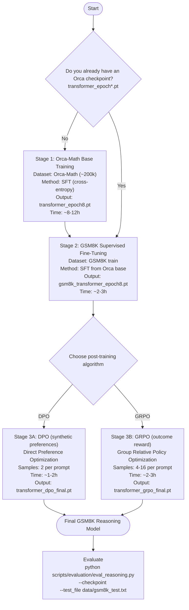

# pico-llm

A small transformer for math reasoning, trained on Orca-Math and fine-tuned on GSM8K.

Includes interpretability tools for analyzing attention patterns and neuron activations. Supports models from 10M to 1.5B parameters.

---

## 🎯 New: Complete 3-Stage Training Pipeline

This repository now includes a **complete 3-stage training pipeline** for building GSM8K reasoning models with preference-based post-training (DPO/GRPO).

> Note: In many production stacks, DPO is trained on *human preference pairs* or a reward model.
> Here, Stage 3 constructs **synthetic preferences from GSM8K answer correctness** (an automatic verifier), i.e. **RLAIF-style**.

### 📊 Pipeline Architecture (Mermaid)



### 🚀 Quick Start (One Command)

```bash
# Run complete pipeline (skip Stage 1 if Orca checkpoint already exists)
SKIP_STAGE1=1 bash scripts/full_pipeline_gsm8k.sh dpo medium

# Or use GRPO (group-based policy optimization)
SKIP_STAGE1=1 bash scripts/full_pipeline_gsm8k.sh grpo medium

# Non-interactive / remote (no confirmation prompt)
YES=1 SKIP_STAGE1=1 bash scripts/full_pipeline_gsm8k.sh dpo medium
```

**This will**:
- ✅ Skip Stage 1 (Orca - already trained)
- 🔄 Run Stage 2 (GSM8K SFT) → ~2-3 hours
- 🔄 Run Stage 3 (DPO/GRPO, RLAIF-style) → ~1-3 hours
- ✅ Output final reasoning model

**Total time**: ~3-6 hours on GTX TITAN X

### 🧭 How to start post-training (Stage 3)

Post-training (DPO/GRPO) assumes you already have a **GSM8K SFT checkpoint** from Stage 2.

1) **Run Stage 2 (GSM8K SFT)** (recommended: disable the legacy RL refinement)

```bash
# Produces: .../gsm8k_transformer_epoch*.pt
RUN_RL=0 bash scripts/train.sh gsm8k medium
```

2) **Run Stage 3 (DPO or GRPO)**

Use either the convenience wrapper or call the training script directly.

- Wrapper (auto-finds latest GSM8K SFT checkpoint):

```bash
# DPO (pairwise, 2 samples/prompt)
YES=1 bash scripts/train_dpo_grpo.sh dpo medium

# GRPO (grouped, outcome reward)
YES=1 bash scripts/train_dpo_grpo.sh grpo medium
```

- Common knobs (environment variables passed through by `scripts/train_dpo_grpo.sh`):

```bash
# Typical: conservative DPO
YES=1 BETA=0.1 TOP_P=0.95 TEMPERATURE=0.7 STEPS=800 bash scripts/train_dpo_grpo.sh dpo medium

# Typical: GRPO with stronger KL and more samples
YES=1 NUM_SAMPLES=8 KL_COEF=0.02 TOP_P=0.95 TEMPERATURE=0.8 STEPS=1200 bash scripts/train_dpo_grpo.sh grpo medium
```

If you want explicit control over paths/hparams, run:

```bash
python scripts/evaluation/dpo_grpo_training.py --help
```

### 🎯 Key Features

- ✅ **DPO + GRPO implementations** for post-training
- ✅ **Vectorized log-prob computation** with **per-token KL proxy** (typical in practice)
- ✅ **GSM8K-aware answer extraction** (handles `#### answer` format)
- ✅ **Reference model** support (stability / KL regularization)
- ✅ **Hardware-oriented defaults** for 12GB VRAM GPUs

---

## Quick Start (Legacy)

These commands are kept for reproducibility with earlier experiments.

- For a more industry-standard preference-training stack, prefer the **3-stage pipeline above**.
- The legacy GSM8K script optionally includes an outcome-RL refinement loop; when using DPO/GRPO, it is recommended to disable it via `RUN_RL=0`.

```bash
# 1. Train base model on Orca-Math (~8-10 hours)
bash scripts/train.sh orca

# 2. Fine-tune on GSM8K (SFT). Recommended setting for the new pipeline:
RUN_RL=0 bash scripts/train.sh gsm8k

# 3. Evaluate
python scripts/evaluation/eval_reasoning.py \
  --checkpoint /scratch/kk6081/picollm_extend/gsm8k_transformer_epoch8.pt
```

### Model Sizes

| Size | Parameters | Memory | Fits on GTX TITAN X (12GB) |
|------|-----------|--------|---------------------------|
| `small` | 10M | ~2GB | ✅ Yes |
| `medium` (default) | 40M | ~4GB | ✅ Yes |
| `gpt2-small` | 117M | ~8GB | ✅ Yes (tight) |

**Recommended for your hardware:** `small`, `medium`, or `gpt2-small` with reduced batch size.

```bash
# Train with gpt2-small (max for 12GB GPU)
BATCH=8 TRANSFORMER_SIZE=gpt2-small bash scripts/train.sh orca
```

## Configuration

You can control training parameters using environment variables:

```bash
# Model & Data
TRANSFORMER_SIZE=medium          # small, medium, gpt2-*
MAX_SAMPLES=100000              # Orca-Math examples to use

# Training
BATCH=16                        # Batch size (reduce if OOM)
EPOCHS=8                        # Number of epochs
LR=3e-4                         # Learning rate
DEVICE=cuda:0                   # GPU device

# Example: Train larger model with more epochs
TRANSFORMER_SIZE=gpt2-small EPOCHS=10 bash scripts/train.sh orca
```

## Training Modes

The unified `scripts/train.sh` handles all training workflows:

```bash
# Base training on Orca-Math
bash scripts/train.sh orca [model_size]

# Fine-tune on GSM8K (auto-detects latest checkpoint)
bash scripts/train.sh gsm8k [model_size]

# Train GPT-2 models
bash scripts/train.sh gpt2 [gpt2-small|gpt2-medium|gpt2-large|gpt2-xl]
```

### Legacy outcome-RL refinement (optional)

The GSM8K training script can optionally run an additional outcome-RL refinement loop after SFT.
This is **not required** when using Stage 3 (DPO/GRPO).

```bash
# Skip RL refinement (recommended when doing DPO/GRPO)
RUN_RL=0 bash scripts/train.sh gsm8k

# Enable RL refinement (legacy baseline)
RUN_RL=1 RL_STEPS=400 bash scripts/train.sh gsm8k
```

## Interpretability

Analyze attention patterns, neuron activations, and internal representations:

```bash
# Generate interpretability data
python scripts/utils/interpret_transformer.py \
  --checkpoint /scratch/kk6081/picollm_extend/transformer_epoch8.pt \
  --analysis attention,logit_lens,neurons \
  --out_dir /scratch/kk6081/picollm_extend/interpretability

# View results in browser
python scripts/utils/interpretability_viewer.py \
  --root /scratch/kk6081/picollm_extend/interpretability \
  --port 8000
```

Outputs:
- Attention heatmaps per layer/head
- Logit lens (token predictions at each layer)
- Top neurons with max-activating contexts

Inspired by [Transformer Circuits](https://transformer-circuits.pub/)

## Repository Structure

```
pico-llm/
├── pico-llm.py              # Main training script
├── inference.py             # Text generation
├── plot_losses.py           # Visualize training curves
├── scripts/
│   ├── train.sh            # Unified training script (orca/gsm8k/gpt2)
│   ├── data_prep/          # Dataset preparation
│   │   ├── prepare_orca_math_data.py
│   │   └── prepare_hf_gsm8k_data.sh
│   ├── evaluation/         # Model evaluation
│   │   ├── eval_reasoning.py
│   │   └── rl_reasoning_outcome.py
│   └── utils/              # Utilities
│       ├── check_checkpoint_arch.py
│       ├── interpret_transformer.py
│       └── interpretability_viewer.py
└── data/                   # Training data (auto-downloaded)
```

## Additional Resources

- **Quick reference**: See `QUICKSTART.txt` for common commands
- **Datasets**: Orca-Math-200k, GSM8K
- **Inspiration**: [Transformer Circuits](https://transformer-circuits.pub/), [DeepSeek-R1](https://arxiv.org/abs/2501.12948)

