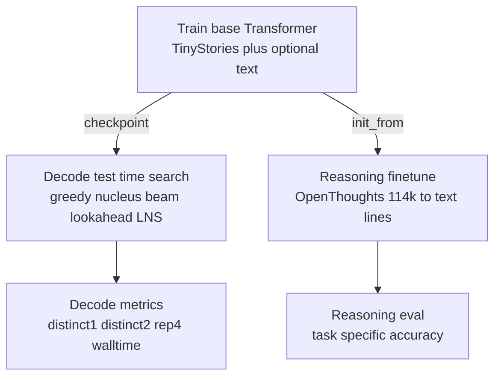

# pico-llm
CSCI-GA.2565 — Pico-LLM

## Overview
This repository contains implementations of three language modeling approaches:
1. **K-gram MLP**: Fixed-window feedforward model with optimized vectorized operations
2. **LSTM**: Recurrent neural network with long short-term memory
3. **Transformer**: Attention-based decoder-only model (GPT-style)

### Key Features
- **Optimized K-gram MLP**: Uses `unfold()` for vectorized sliding window processing (much faster than nested loops)
- **Helper Scripts**:
  - `inference.py`: Run inference / decoding experiments
  - `plot_losses.py`: Plot training curves
  - `train_all_models.sh`: Convenient training script for all models

## Environment / constraints (project settings)
- GPU: 2× GTX TITAN X (12GB); project runs on **`cuda:0`** by default.
- Venv: `/scratch/kk6081/ml_fall25/venv/`
- Checkpoints/artifacts: **`/scratch/kk6081/picollm_extend/`** (see `--checkpoint_dir`)
- Focus: **Transformer-only improvements** (test-time search + reasoning finetune)

## High-level flow (Transformer-only)



## Quick Start

Activate the required environment:

```bash
source /scratch/kk6081/ml_fall25/venv/bin/activate
```

### 1) Fast dev: train a small Transformer checkpoint

This repo adds two training flags to scale up Transformer training:
- `--transformer_size {small,medium}`
  - `small`: `embed=384 heads=4 blocks=3 ff_mult=2`
  - `medium`: `embed=512 heads=8 blocks=6 ff_mult=4`
- `--tinystories_train_subset_size N` (default `20000`)

The helper scripts are set up with larger defaults (override via env vars):
- `scripts/train_transformer_fast.sh`: `TRANSFORMER_SIZE=medium`, `TINYSTORIES_SUBSET=100000`
- `scripts/train_transformer_full.sh`: `TRANSFORMER_SIZE=medium`, `TINYSTORIES_SUBSET=200000`

Run fast dev training:

```bash
bash scripts/train_transformer_fast.sh
```

If you hit out-of-memory (12GB GPU), try:
- `BATCH=8` (or `4`)
- `BLOCK_SIZE=256`
- `TRANSFORMER_SIZE=small`

### 2) Test-time decoding/search experiments

`inference.py` supports these decoding modes (Transformer):
- `--decode greedy`
- `--decode nucleus`
- `--decode beam`
- `--decode lookahead` (Lookahead Nucleus Search / LNS)

Example grid (fast settings):

```bash
bash scripts/run_tts_grid.sh transformer_epoch1.pt "Once upon a time" --fast
```

### 3) Reasoning finetune using an existing dataset (Hugging Face)

Default reasoning dataset:
- `open-thoughts/OpenThoughts-114k`

Finetune script:

```bash
bash scripts/train_transformer_reasoning.sh
```

Notes:
- Uses `--init_from /scratch/kk6081/picollm_extend/transformer_epoch1.pt` by default.
- Writes finetune checkpoints in an isolated subdir then copies them back as:
  - `/scratch/kk6081/picollm_extend/transformer_reasoning_transformer_epoch*.pt`

### 4) Reasoning evaluation (accuracy)

```bash
python scripts/eval_reasoning.py \
  --checkpoint /scratch/kk6081/picollm_extend/transformer_reasoning_transformer_epoch1.pt \
  --data data/open_thoughts_val.txt \
  --decode greedy
```

You can compare test-time strategies on the reasoning prompts too:
- `--decode nucleus`
- `--decode beam`
- `--decode lookahead`

## What is Lookahead Nucleus Search (LNS)?

At each generation step:
1. Compute the model distribution for the next token.
2. Take the top-`K` candidate tokens by log-probability.
3. For each candidate, do a short rollout of length `H` (sampling with nucleus/top-p).
4. Score each candidate:

**Score = average logprob(rollout) − rep_penalty * repetition(rollout)**

Then pick the candidate with the best score.

## Normalization
1. Toggle Pre/Post-Normalization by setting `--norm_type=pre` (default) or `--norm_type=post`
2. Enable SGD with no warmup by setting `--warmup=no`
3. Enable SGD with warmup by setting `--warmup=yes`

## Interpretability & Analysis

This repo includes interpretability tooling (`scripts/interpret_transformer.py`) inspired by Anthropic / Transformer Circuits mechanistic interpretability work.

### Background (and how each analysis maps to the literature)

Core reading hub:
- Transformer Circuits (Anthropic): https://transformer-circuits.pub/

We reference specific posts in the *relevant analysis* below:
- **Circuit / attention-head thinking**: **[A Mathematical Framework for Transformer Circuits](https://transformer-circuits.pub/2021/framework/index.html)**
- **Induction heads / copying patterns**: **[In-context Learning and Induction Heads](https://transformer-circuits.pub/2022/in-context-learning-and-induction-heads/index.html)**
- **Feature discovery & monosemanticity** (conceptual inspiration for neuron/feature analysis): **[Towards Monosemanticity](https://transformer-circuits.pub/2023/monosemantic-features/index.html)**
- **Superposition & polysemanticity** (why neurons can be hard to interpret): **[Toy Models of Superposition](https://transformer-circuits.pub/2022/toy_model/index.html)**

### How to run interpretability

**Important:** `interpret_transformer.py` must be given architecture flags that match the checkpoint.

#### Analysis A) Attention Pattern Analysis

**Related reading:**
- [A Mathematical Framework for Transformer Circuits](https://transformer-circuits.pub/2021/framework/index.html)
- [In-context Learning and Induction Heads](https://transformer-circuits.pub/2022/in-context-learning-and-induction-heads/index.html)

```bash
python scripts/interpret_transformer.py \
  --checkpoint /scratch/kk6081/picollm_extend/transformer_epoch1.pt \
  --analysis attention \
  --out_dir interpretability_results \
  --embed_size 384 --transformer_heads 4 --transformer_blocks 3 --ff_mult 2 \
  --test_prompts "Once upon a time" "What is 2 + 2?" \
  --device cuda:0
```

**Output:** PNG heatmaps in `interpretability_results/attention/`.

#### Analysis B) Logit Lens (Intermediate Predictions)

This is a simple “decode every layer” diagnostic (not a full circuits method), but it pairs well with the circuit-frame perspective in the Framework post.

**Related reading:**
- [A Mathematical Framework for Transformer Circuits](https://transformer-circuits.pub/2021/framework/index.html)

```bash
python scripts/interpret_transformer.py \
  --checkpoint /scratch/kk6081/picollm_extend/transformer_epoch1.pt \
  --analysis logit_lens \
  --out_dir interpretability_results \
  --embed_size 384 --transformer_heads 4 --transformer_blocks 3 --ff_mult 2 \
  --test_prompts "The capital of France is" "2 + 2 =" \
  --device cuda:0
```

**Output:** `interpretability_results/logit_lens/results.json`.

#### Analysis C) Neuron Activation Analysis (max-activating contexts)

This is a lightweight starting point for “feature discovery”. In real mechanistic interpretability work, neurons are often *not* monosemantic; the links below explain why and what to do next.

**Related reading:**
- [Towards Monosemanticity](https://transformer-circuits.pub/2023/monosemantic-features/index.html)
- [Toy Models of Superposition](https://transformer-circuits.pub/2022/toy_model/index.html)

```bash
python scripts/interpret_transformer.py \
  --checkpoint /scratch/kk6081/picollm_extend/transformer_epoch1.pt \
  --analysis neurons \
  --out_dir interpretability_results \
  --embed_size 384 --transformer_heads 4 --transformer_blocks 3 --ff_mult 2 \
  --neuron_top_k 10 \
  --test_prompts "Once upon a time there was a princess" "The scientist discovered" \
  --device cuda:0
```

**Output:** `interpretability_results/neurons/top_neurons.json`.

#### Analysis D) Activation Patching (Causal Analysis) (experimental)

This is a stub/framework for causal interventions; it currently reports structure and writes results, but a full implementation requires forward hooks.

**Related reading (conceptual):**
- [A Mathematical Framework for Transformer Circuits](https://transformer-circuits.pub/2021/framework/index.html)

```bash
python scripts/interpret_transformer.py \
  --checkpoint /scratch/kk6081/picollm_extend/transformer_epoch1.pt \
  --analysis activation_patch \
  --out_dir interpretability_results \
  --embed_size 384 --transformer_heads 4 --transformer_blocks 3 --ff_mult 2 \
  --test_prompts "Once upon a time" \
  --device cuda:0
```

**Output:** `interpretability_results/patching/results.json`.

#### Run multiple analyses

```bash
python scripts/interpret_transformer.py \
  --checkpoint /scratch/kk6081/picollm_extend/transformer_epoch1.pt \
  --analysis attention,logit_lens,neurons \
  --out_dir interpretability_results \
  --embed_size 384 --transformer_heads 4 --transformer_blocks 3 --ff_mult 2 \
  --test_prompts "Once upon a time" "The cat sat on" "What is" \
  --neuron_top_k 10 \
  --device cuda:0
```

### Interpretability results (smoke test)

Verified outputs were generated under:
- `/scratch/kk6081/picollm_extend/interpretability_test/`

Files produced:
- Attention heatmaps (PNGs): `interpretability_test/attention/attn_*.png`
- Logit lens: `interpretability_test/logit_lens/results.json`
- Neuron analysis: `interpretability_test/neurons/top_neurons.json`
- Summary metadata: `interpretability_test/summary.json`

## End-to-end: run the full pipeline (Transformer → reasoning → decoding → interpretability)

### TL;DR (5 commands)

From a clean shell:

```bash
source /scratch/kk6081/ml_fall25/venv/bin/activate
cd /home/kk6081/pico_llm_extend/pico-llm
bash scripts/train_transformer_fast.sh
bash scripts/train_transformer_reasoning.sh
python scripts/interpret_transformer.py --checkpoint /scratch/kk6081/picollm_extend/transformer_reasoning_transformer_epoch1.pt --analysis attention,logit_lens,neurons --out_dir /scratch/kk6081/picollm_extend/interpretability_reasoning --embed_size 384 --transformer_heads 4 --transformer_blocks 3 --ff_mult 2 --test_prompts "What is 2 + 2?" "Once upon a time" --device cuda:0
```

(Optionally) evaluate reasoning / run decoding search after finetune:

```bash
python scripts/eval_reasoning.py --checkpoint /scratch/kk6081/picollm_extend/transformer_reasoning_transformer_epoch1.pt --data data/open_thoughts_val.txt --decode greedy
python inference.py --checkpoint /scratch/kk6081/picollm_extend/transformer_epoch1.pt --prompt "Once upon a time" --decode lookahead --lookahead_k 8 --lookahead_h 6 --device cuda:0
```

All commands assume:

```bash
source /scratch/kk6081/ml_fall25/venv/bin/activate
cd /home/kk6081/pico_llm_extend/pico-llm
```

### Step 1) Train a base Transformer (TinyStories)

Fast dev run (uses `/scratch/kk6081/picollm_extend/` by default):

```bash
bash scripts/train_transformer_fast.sh
```

After this you should have a checkpoint like:
- `/scratch/kk6081/picollm_extend/transformer_epoch1.pt`

### Step 2) Test-time decoding / search (greedy / nucleus / beam / lookahead)

Example:

```bash
python inference.py \
  --checkpoint /scratch/kk6081/picollm_extend/transformer_epoch1.pt \
  --prompt "Once upon a time" \
  --decode lookahead \
  --lookahead_k 8 --lookahead_h 6 \
  --device cuda:0
```

Or run the pre-made grid:

```bash
bash scripts/run_tts_grid.sh transformer_epoch1.pt "Once upon a time" --fast
```

### Step 3) Finetune on reasoning data (OpenThoughts-114k)

This script will (a) prepare HF data → text lines and (b) finetune from `--init_from`.

```bash
bash scripts/train_transformer_reasoning.sh
```

Expected outputs (copied back with a prefix):
- `/scratch/kk6081/picollm_extend/transformer_reasoning_transformer_epoch1.pt`

### Step 4) Evaluate reasoning (current metric is heuristic)

```bash
python scripts/eval_reasoning.py \
  --checkpoint /scratch/kk6081/picollm_extend/transformer_reasoning_transformer_epoch1.pt \
  --data data/open_thoughts_val.txt \
  --decode greedy
```

### Step 5) Run interpretability on either checkpoint

Base model:

```bash
python scripts/interpret_transformer.py \
  --checkpoint /scratch/kk6081/picollm_extend/transformer_epoch1.pt \
  --analysis attention,logit_lens,neurons \
  --out_dir /scratch/kk6081/picollm_extend/interpretability_base \
  --embed_size 384 --transformer_heads 4 --transformer_blocks 3 --ff_mult 2 \
  --test_prompts "Once upon a time" "The cat sat on" \
  --device cuda:0
```

Reasoning-finetuned model:

```bash
python scripts/interpret_transformer.py \
  --checkpoint /scratch/kk6081/picollm_extend/transformer_reasoning_transformer_epoch1.pt \
  --analysis attention,logit_lens,neurons \
  --out_dir /scratch/kk6081/picollm_extend/interpretability_reasoning \
  --embed_size 384 --transformer_heads 4 --transformer_blocks 3 --ff_mult 2 \
  --test_prompts "What is 2 + 2?" "If Alice has 3 apples" \
  --device cuda:0
```

## Requirements
- Python 3.8+
- PyTorch
- tiktoken
- datasets
- matplotlib

