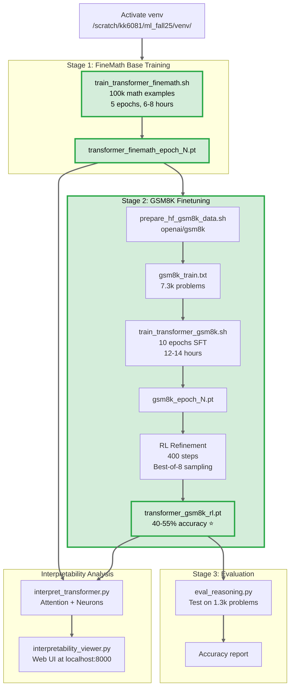

# pico-llm

Production Transformer training system for mathematical reasoning:
- **FineMath base** → **GSM8K finetuning** → **RL refinement** → **40-55% accuracy**
- Built-in interpretability analysis (attention, neurons, logit lens)

## Training Pipeline



## Environment / constraints
- GPU: 2x GTX TITAN X (12GB). Default device: **`cuda:0`**
- Venv: `/scratch/kk6081/ml_fall25/venv/`
- Artifacts/checkpoints: **`/scratch/kk6081/picollm_extend/`**

## TL;DR (quick start commands)

### Complete Training Pipeline: FineMath → GSM8K ⭐

```bash
source /scratch/kk6081/ml_fall25/venv/bin/activate
cd /home/kk6081/pico_llm_extend/pico-llm

# 1) Train on FineMath (mathematical reasoning base) - 6-8 hours
EPOCHS=5 MAX_SAMPLES=100000 bash scripts/train_transformer_finemath.sh

# 2) Train on GSM8K with RL - 12-14 hours
BASE_CKPT="/scratch/kk6081/picollm_extend/transformer_finemath_epoch5.pt" \
  EPOCHS=10 LR=5e-4 RUN_RL=1 \
  bash scripts/train_transformer_gsm8k.sh

# 3) Evaluate
python scripts/eval_reasoning.py \
  --checkpoint /scratch/kk6081/picollm_extend/transformer_gsm8k_rl.pt \
  --data data/gsm8k_test.txt

# Expected: 40-55% GSM8K accuracy with MEDIUM model!
# Total training time: ~20 hours
```

### Quick Evaluation & Interpretability

```bash
# Evaluate GSM8K accuracy
python scripts/eval_reasoning.py \
  --checkpoint /scratch/kk6081/picollm_extend/transformer_gsm8k_rl.pt \
  --data data/gsm8k_test.txt

# Interpretability analysis
python scripts/interpret_transformer.py \
  --checkpoint /scratch/kk6081/picollm_extend/transformer_finemath_epoch5.pt \
  --analysis attention,logit_lens,neurons \
  --out_dir /scratch/kk6081/picollm_extend/interpretability \
  --embed_size 512 --transformer_heads 8 --transformer_blocks 6 --ff_mult 4 \
  --test_prompts "Problem: If x + 5 = 12, then x =" \
  --device cuda:0

# View interpretability results in browser
python scripts/interpretability_viewer.py \
  --root /scratch/kk6081/picollm_extend/interpretability \
  --host 127.0.0.1 --port 8000
```

## 📚 Expected Results

| Training Stage | Checkpoint | Accuracy | Time |
|---------------|------------|----------|------|
| **FineMath Base** | transformer_finemath_epoch5.pt | - | 6-8h |
| **GSM8K SFT** | gsm8k_epoch10.pt | 35-45% | 10-12h |
| **RL Refinement** ⭐ | transformer_gsm8k_rl.pt | **40-55%** | 2-3h |

**Total**: ~20 hours for production-quality math reasoning model

**Datasets**:
- **FineMath-4plus**: 100k high-quality math examples (base training)
- **GSM8K**: 7.3k grade school math word problems (finetuning)

---

## Training

### FineMath Base Training

Train transformer base model on high-quality mathematical reasoning text:

```bash
bash scripts/train_transformer_finemath.sh
```

**Default settings:**
- 100k math examples from FineMath-4plus
- 5 epochs, ~6-8 hours on GTX TITAN X
- MEDIUM architecture (512d, 8h, 6b)
- Learning rate: 2e-4 with cosine schedule

**If OOM on 12GB**: Set `BATCH=8` (or `4`) and/or `TRANSFORMER_SIZE=small`

**Key parameters**: `TRANSFORMER_SIZE` (small/medium), `MAX_SAMPLES`, `BATCH`, `EPOCHS`, `LR`

```bash
# Example: Train with more data
TRANSFORMER_SIZE=medium MAX_SAMPLES=200000 EPOCHS=8 bash scripts/train_transformer_finemath.sh
```

## GSM8K Math Reasoning Training

### Step-by-Step Guide

**1. Prepare GSM8K Data** (automatic, runs on first training):
```bash
bash scripts/prepare_hf_gsm8k_data.sh
```
Downloads GSM8K dataset from HuggingFace and creates:
- `data/gsm8k_train.txt` (7,324 examples)
- `data/gsm8k_val.txt` (split from train)
- `data/gsm8k_test.txt` (1,319 examples)

**2. Train on GSM8K**:
```bash
BASE_CKPT="/scratch/kk6081/picollm_extend/transformer_finemath_epoch5.pt" \
  EPOCHS=10 LR=5e-4 RUN_RL=1 \
  bash scripts/train_transformer_gsm8k.sh
```

**3. Evaluate**:
```bash
python scripts/eval_reasoning.py \
  --checkpoint /scratch/kk6081/picollm_extend/transformer_gsm8k_rl.pt \
  --data data/gsm8k_test.txt
```

**Key parameters**: `EPOCHS` (10 recommended), `LR` (5e-4), `RUN_RL` (1 to enable), `RL_STEPS` (400)

**RL refinement**: Best-of-N sampling + outcome-based rewards ([DeepSeek-R1](https://arxiv.org/abs/2501.12948))

## Interpretability

Analyze attention patterns, neuron activations, and logit lens:

```bash
python scripts/interpret_transformer.py \
  --checkpoint /scratch/kk6081/picollm_extend/transformer_finemath_epoch5.pt \
  --analysis attention,logit_lens,neurons \
  --out_dir /scratch/kk6081/picollm_extend/interpretability

# View results in browser
python scripts/interpretability_viewer.py --root /scratch/kk6081/picollm_extend/interpretability
```

**Resources**: [Transformer Circuits](https://transformer-circuits.pub/) (Anthropic mechanistic interpretability research)

---

## 📁 Repository Structure

### Training Scripts
- `train_transformer_finemath.sh` ⭐ - Train base model on FineMath (math-focused)
- `train_transformer_gsm8k.sh` - GSM8K finetuning + optional RL
- `train_transformer_full.sh` - (Legacy) Train on TinyStories (general language)
- `train_transformer_fast.sh` - (Legacy) Quick TinyStories training for testing

### Data Preparation
- `prepare_hf_finemath_data.py` - Download FineMath from HuggingFace
- `prepare_hf_gsm8k_data.sh` - Download GSM8K from HuggingFace

### Evaluation & Analysis
- `eval_reasoning.py` - Evaluate GSM8K accuracy
- `interpret_transformer.py` - Attention/neuron analysis
- `interpretability_viewer.py` - Web UI for interpretability results
- `rl_reasoning_outcome.py` - RL refinement script (called by train_transformer_gsm8k.sh)

### Utilities
- `check_checkpoint_arch.py` - Inspect checkpoint architecture
- `training_stability_patch.py` - Apply training improvements to pico-llm.py

### Core
- `pico-llm.py` - Main training script (Transformer + LSTM implementations)
- `inference.py` - Generate text from trained models
- `plot_losses.py` - Visualize training curves

---

## 🎯 Quick Reference Card

| Task | Command | Time |
|------|---------|------|
| **Math base training** | `bash scripts/train_transformer_finemath.sh` | 6-8h |
| **GSM8K training** | `BASE_CKPT=... bash scripts/train_transformer_gsm8k.sh` | 12-14h |
| **Evaluate GSM8K** | `python scripts/eval_reasoning.py --checkpoint ... --data data/gsm8k_test.txt` | 5-10m |
| **Interpretability** | `python scripts/interpret_transformer.py --checkpoint ...` | 2-5m |
| **View results** | `python scripts/interpretability_viewer.py --root ...` | instant |

**Total time for best model**: ~20 hours (FineMath base + GSM8K + RL)

