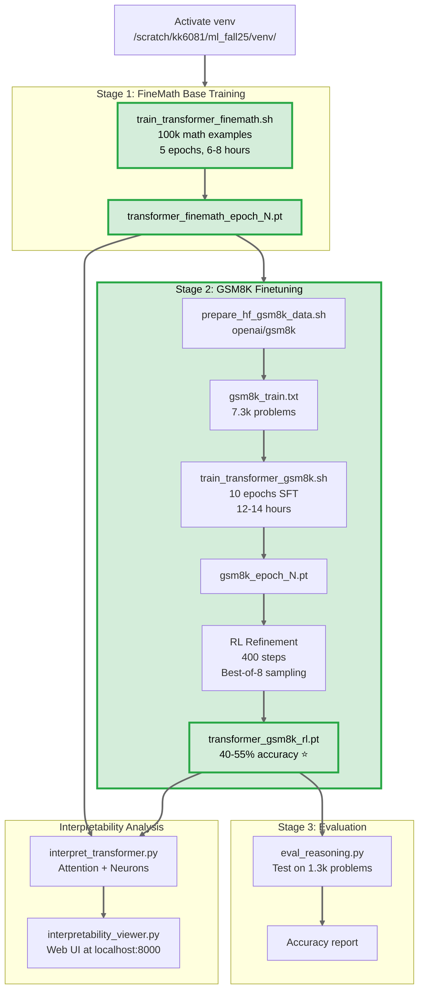

# pico-llm (Transformer-only extension)

Educational Transformer project with focus on mathematical reasoning:
- **Base training** on FineMath (high-quality mathematical reasoning text)
- **Math reasoning**: GSM8K finetuning with optional RL refinement
- **Interpretability** tooling inspired by Anthropic / Transformer Circuits

## Comprehensive flowchart



## Environment / constraints
- GPU: 2x GTX TITAN X (12GB). Default device: **`cuda:0`**
- Venv: `/scratch/kk6081/ml_fall25/venv/`
- Artifacts/checkpoints: **`/scratch/kk6081/picollm_extend/`**

## TL;DR (quick start commands)

### Complete Training Pipeline: FineMath → GSM8K ⭐

```bash
source /scratch/kk6081/ml_fall25/venv/bin/activate
cd /home/kk6081/pico_llm_extend/pico-llm

# 1) Train on FineMath (mathematical reasoning base) - 6-8 hours
EPOCHS=5 MAX_SAMPLES=100000 bash scripts/train_transformer_finemath.sh

# 2) Train on GSM8K with RL - 12-14 hours
BASE_CKPT="/scratch/kk6081/picollm_extend/transformer_finemath_epoch5.pt" \
  EPOCHS=10 LR=5e-4 RUN_RL=1 \
  bash scripts/train_transformer_gsm8k.sh

# 3) Evaluate
python scripts/eval_reasoning.py \
  --checkpoint /scratch/kk6081/picollm_extend/transformer_gsm8k_rl.pt \
  --data data/gsm8k_test.txt

# Expected: 40-55% GSM8K accuracy with MEDIUM model!
# Total training time: ~20 hours
```

### Quick Evaluation & Interpretability

```bash
# Evaluate GSM8K accuracy
python scripts/eval_reasoning.py \
  --checkpoint /scratch/kk6081/picollm_extend/transformer_gsm8k_rl.pt \
  --data data/gsm8k_test.txt

# Interpretability analysis
python scripts/interpret_transformer.py \
  --checkpoint /scratch/kk6081/picollm_extend/transformer_finemath_epoch5.pt \
  --analysis attention,logit_lens,neurons \
  --out_dir /scratch/kk6081/picollm_extend/interpretability \
  --embed_size 512 --transformer_heads 8 --transformer_blocks 6 --ff_mult 4 \
  --test_prompts "Problem: If x + 5 = 12, then x =" \
  --device cuda:0

# View interpretability results in browser
python scripts/interpretability_viewer.py \
  --root /scratch/kk6081/picollm_extend/interpretability \
  --host 127.0.0.1 --port 8000
```

## 📚 Key Concepts

### Why FineMath Base?

**FineMath** provides high-quality mathematical reasoning text that naturally transfers to GSM8K:
- ✅ **Step-by-step solutions**: "Therefore, x = ...", "Simplify..."
- ✅ **Math vocabulary**: "Given that...", "Solve for x", "Calculate..."
- ✅ **Clean patterns**: No narrative contamination, pure mathematical reasoning
- ✅ **Natural transfer**: Math base → Math task (GSM8K)

### Expected Results

| Training Stage | Checkpoint | Accuracy | Time |
|---------------|------------|----------|------|
| **FineMath Base** | transformer_finemath_epoch5.pt | - | 6-8h |
| **GSM8K SFT** | gsm8k_epoch10.pt | 35-45% | 10-12h |
| **RL Refinement** ⭐ | transformer_gsm8k_rl.pt | **40-55%** | 2-3h |

**Total**: ~20 hours for production-quality math reasoning model

### Datasets Used

- **FineMath-4plus** (base): 100k high-quality math examples from HuggingFace
- **GSM8K** (finetuning): 7.3k grade school math word problems
- **RL refinement**: Best-of-n sampling for answer selection

## 🚀 Quick Start: Apply Training Patches (RECOMMENDED)

**Before your first training run**, apply stability patches for 30-50% faster convergence:

```bash
# 1. Preview what will be changed (safe, no modifications)
python scripts/training_stability_patch.py --dry-run

# 2. Apply patches to pico-llm.py (creates backup automatically)
python scripts/training_stability_patch.py --apply

# 3. Train as normal - patches are now active!
bash scripts/train_transformer_fast.sh
```

**What gets patched**:
- ✅ **GPT-2 style weight initialization** - prevents exploding/vanishing gradients
- ✅ **Improved AdamW settings** - better convergence (beta2=0.95, weight_decay=0.1)
- ✅ **Gradient norm monitoring** - detect instability early (logs grad_norm in training)
- ✅ **Early stopping** - saves best checkpoint, stops if validation loss plateaus

**Verification**: After applying, your training logs will show:
```
[transformer] Epoch 1/3, Step 20/200 (global step: 20) Loss: 4.2341, Grad_norm: 2.156, LR: 1.50e-04
```

If you see `Grad_norm` and `LR` in logs → patches are active! ✅

**Rollback if needed**:
```bash
# Restore original (backup created automatically)
cp pico-llm.py.backup pico-llm.py
```

📖 **For advanced techniques** (mixed precision, gradient accumulation, LLRD), see: **[TRAINING_IMPROVEMENTS.md](TRAINING_IMPROVEMENTS.md)**

---

## Training

### FineMath Base Training

Train transformer base model on high-quality mathematical reasoning text:

```bash
bash scripts/train_transformer_finemath.sh
```

**Default settings:**
- 100k math examples from FineMath-4plus
- 5 epochs, ~6-8 hours on GTX TITAN X
- MEDIUM architecture (512d, 8h, 6b)
- Learning rate: 2e-4 with cosine schedule

**Scaling knobs** (see `pico-llm.py`):
- `--transformer_size {small,medium}`
- `--tinystories_train_subset_size N`
- Faster training knobs: `--sample_interval_seconds`, `--sample_every_steps`, `--lr_schedule`, `--lr_warmup_steps`, `--lr_min_ratio`

If you hit OOM on 12GB:
- `BATCH=8` (or `4`) and/or `TRANSFORMER_SIZE=small`

### Training Parameters

Environment variables to control training:
```bash
# Model architecture
TRANSFORMER_SIZE=medium          # small (384d, 4h, 3b) or medium (512d, 8h, 6b)
MAX_SAMPLES=100000              # Number of FineMath examples

# Training hyperparameters
BATCH=16                         # Batch size (reduce to 8 or 4 if OOM)
EPOCHS=5                         # Number of epochs
LR=2e-4                          # Learning rate
VAL_SPLIT=0.05                   # Validation split (0.05 = 5%)

# LR scheduling
LR_SCHEDULE=cosine               # none, cosine, or linear
LR_WARMUP_STEPS=500              # Warmup steps for stability
LR_MIN_RATIO=0.1                 # Min LR as fraction of base LR

# Sampling/logging
SAMPLE_INTERVAL_SECONDS=600      # Generate text every N seconds
```

**Example**: Train with more data
```bash
TRANSFORMER_SIZE=medium MAX_SAMPLES=200000 EPOCHS=8 bash scripts/train_transformer_finemath.sh
```

### 🔧 Advanced: Manual Training Improvements

If you want more control beyond the automatic patch, see **[TRAINING_IMPROVEMENTS.md](TRAINING_IMPROVEMENTS.md)** for:
- **Gradient accumulation** - simulate larger batch sizes (effective batch = BATCH × ACCUM_STEPS)
- **Mixed precision training (FP16)** - 2x faster, 50% less memory
- **Layer-wise learning rate decay (LLRD)** - for finetuning only
- **Dropout strategies** - prevent overfitting
- **Curriculum learning** - start with easier examples
- **Troubleshooting guide** - fix loss explosions, plateaus, overfitting

## GSM8K Math Reasoning Training

### Step-by-Step Guide

**1. Prepare GSM8K Data** (automatic, runs on first training):
```bash
bash scripts/prepare_hf_gsm8k_data.sh
```
Downloads GSM8K dataset from HuggingFace and creates:
- `data/gsm8k_train.txt` (7,324 examples)
- `data/gsm8k_val.txt` (split from train)
- `data/gsm8k_test.txt` (1,319 examples)

**2. Train on GSM8K**:
```bash
BASE_CKPT="/scratch/kk6081/picollm_extend/transformer_finemath_epoch5.pt" \
  EPOCHS=10 LR=5e-4 RUN_RL=1 \
  bash scripts/train_transformer_gsm8k.sh
```

**3. Evaluate**:
```bash
python scripts/eval_reasoning.py \
  --checkpoint /scratch/kk6081/picollm_extend/transformer_gsm8k_rl.pt \
  --data data/gsm8k_test.txt
```

### Training Configuration

| Parameter | Default | Notes |
|-----------|---------|-------|
| `EPOCHS` | 8 | Use 10 for better results |
| `LR` | 5e-4 | Learning rate for GSM8K finetuning |
| `RUN_RL` | 1 | Set to 0 to skip RL refinement |
| `RL_STEPS` | 400 | RL refinement iterations |
| `RL_BATCH` | 12 | Batch size for RL |
| `RL_NUM_SAMPLES` | 8 | Best-of-n samples per problem |

**Override examples**:
```bash
# Quick test (no RL, 1 epoch)
EPOCHS=1 RUN_RL=0 bash scripts/train_transformer_gsm8k.sh

# Extended training (15 epochs + RL)
EPOCHS=15 RUN_RL=1 RL_STEPS=600 bash scripts/train_transformer_gsm8k.sh
```

### Understanding RL Refinement

After supervised finetuning (SFT), RL refinement improves answer selection:
1. Generate `N` candidate solutions per problem (best-of-n sampling)
2. Score solutions based on correct final answer
3. Update model to prefer correct reasoning paths

**Reading**:
- [DeepSeek-R1 paper](https://arxiv.org/abs/2501.12948) - RL for reasoning
- [Dr. Tulu draft](https://www.datocms-assets.com/64837/1763496622-dr_tulu_draft.pdf) - Outcome supervision

## Interpretability & analysis

Tool: `scripts/interpret_transformer.py` (attention heatmaps, logit lens, neuron max-activation contexts, patching stub).

### Web UI (browse saved results)

After you generate results with `interpret_transformer.py`, you can browse them with a lightweight local web UI:

```bash
python scripts/interpretability_viewer.py \
  --root /scratch/kk6081/picollm_extend/interpretability_test \
  --host 127.0.0.1 --port 8000
```

Then open: `http://127.0.0.1:8000/`

Transformer Circuits hub:
- https://transformer-circuits.pub/

Referenced posts:
- Framework: https://transformer-circuits.pub/2021/framework/index.html
- Induction heads: https://transformer-circuits.pub/2022/in-context-learning-and-induction-heads/index.html
- Monosemantic features: https://transformer-circuits.pub/2023/monosemantic-features/index.html
- Toy models of superposition: https://transformer-circuits.pub/2022/toy_model/index.html

Example:

```bash
python scripts/interpret_transformer.py \
  --checkpoint /scratch/kk6081/picollm_extend/transformer_epoch1.pt \
  --analysis attention,logit_lens,neurons \
  --out_dir /scratch/kk6081/picollm_extend/interpretability_test \
  --embed_size 384 --transformer_heads 4 --transformer_blocks 3 --ff_mult 2 \
  --test_prompts "Once upon a time" "2 + 2 =" \
  --device cuda:0
```

Outputs:
- `attention/attn_*.png` - Attention heatmaps per layer/head
- `logit_lens/results.json` - Token predictions at each layer
- `neurons/top_neurons.json` - Max-activating contexts for FF neurons
- `summary.json` - Analysis metadata

---

## 📁 Repository Structure

### Training Scripts
- `train_transformer_finemath.sh` ⭐ - Train base model on FineMath (math-focused)
- `train_transformer_gsm8k.sh` - GSM8K finetuning + optional RL
- `train_transformer_full.sh` - (Legacy) Train on TinyStories (general language)
- `train_transformer_fast.sh` - (Legacy) Quick TinyStories training for testing

### Data Preparation
- `prepare_hf_finemath_data.py` - Download FineMath from HuggingFace
- `prepare_hf_gsm8k_data.sh` - Download GSM8K from HuggingFace

### Evaluation & Analysis
- `eval_reasoning.py` - Evaluate GSM8K accuracy
- `interpret_transformer.py` - Attention/neuron analysis
- `interpretability_viewer.py` - Web UI for interpretability results
- `rl_reasoning_outcome.py` - RL refinement script (called by train_transformer_gsm8k.sh)

### Utilities
- `check_checkpoint_arch.py` - Inspect checkpoint architecture
- `training_stability_patch.py` - Apply training improvements to pico-llm.py

### Core
- `pico-llm.py` - Main training script (Transformer + LSTM implementations)
- `inference.py` - Generate text from trained models
- `plot_losses.py` - Visualize training curves

---

## 🎯 Quick Reference Card

| Task | Command | Time |
|------|---------|------|
| **Math base training** | `bash scripts/train_transformer_finemath.sh` | 6-8h |
| **GSM8K training** | `BASE_CKPT=... bash scripts/train_transformer_gsm8k.sh` | 12-14h |
| **Evaluate GSM8K** | `python scripts/eval_reasoning.py --checkpoint ... --data data/gsm8k_test.txt` | 5-10m |
| **Interpretability** | `python scripts/interpret_transformer.py --checkpoint ...` | 2-5m |
| **View results** | `python scripts/interpretability_viewer.py --root ...` | instant |

**Total time for best model**: ~20 hours (FineMath base + GSM8K + RL)

