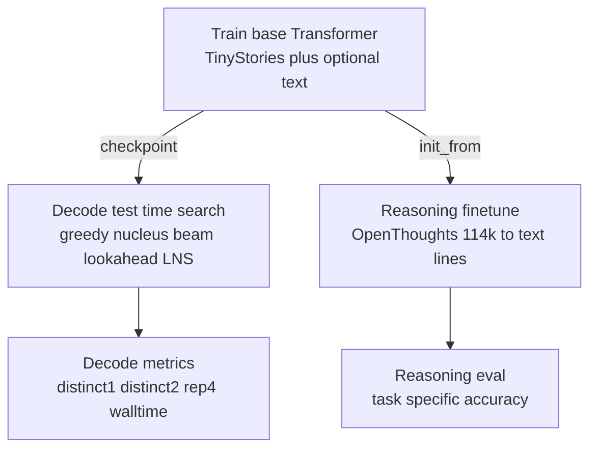

# pico-llm
CSCI-GA.2565 — Pico-LLM

## Overview
This repository contains implementations of three language modeling approaches:
1. **K-gram MLP**: Fixed-window feedforward model with optimized vectorized operations
2. **LSTM**: Recurrent neural network with long short-term memory
3. **Transformer**: Attention-based decoder-only model (GPT-style)

### Key Features
- **Optimized K-gram MLP**: Uses `unfold()` for vectorized sliding window processing (much faster than nested loops)
- **Helper Scripts**:
  - `inference.py`: Run inference / decoding experiments
  - `plot_losses.py`: Plot training curves
  - `train_all_models.sh`: Convenient training script for all models

## Environment / constraints (project settings)
- GPU: 2× GTX TITAN X (12GB); project runs on **`cuda:0`** by default.
- Venv: `/scratch/kk6081/ml_fall25/venv/`
- Checkpoints/artifacts: **`/scratch/kk6081/picollm_extend/`** (see `--checkpoint_dir`)
- Focus: **Transformer-only improvements** (test-time search + reasoning finetune)

## High-level flow (Transformer-only)



## Quick Start

Activate the required environment:

```bash
source /scratch/kk6081/ml_fall25/venv/bin/activate
```

### 1) Fast dev: train a small Transformer checkpoint

This repo adds two training flags to scale up Transformer training:
- `--transformer_size {small,medium}`
  - `small`: `embed=384 heads=4 blocks=3 ff_mult=2`
  - `medium`: `embed=512 heads=8 blocks=6 ff_mult=4`
- `--tinystories_train_subset_size N` (default `20000`)

The helper scripts are set up with larger defaults (override via env vars):
- `scripts/train_transformer_fast.sh`: `TRANSFORMER_SIZE=medium`, `TINYSTORIES_SUBSET=100000`
- `scripts/train_transformer_full.sh`: `TRANSFORMER_SIZE=medium`, `TINYSTORIES_SUBSET=200000`

Run fast dev training:

```bash
bash scripts/train_transformer_fast.sh
```

If you hit out-of-memory (12GB GPU), try:
- `BATCH=8` (or `4`)
- `BLOCK_SIZE=256`
- `TRANSFORMER_SIZE=small`

### 2) Test-time decoding/search experiments

`inference.py` supports these decoding modes (Transformer):
- `--decode greedy`
- `--decode nucleus`
- `--decode beam`
- `--decode lookahead` (Lookahead Nucleus Search / LNS)

Example grid (fast settings):

```bash
bash scripts/run_tts_grid.sh transformer_epoch1.pt "Once upon a time" --fast
```

### 3) Reasoning finetune using an existing dataset (Hugging Face)

Default reasoning dataset:
- `open-thoughts/OpenThoughts-114k`

Finetune script:

```bash
bash scripts/train_transformer_reasoning.sh
```

Notes:
- Uses `--init_from /scratch/kk6081/picollm_extend/transformer_epoch1.pt` by default.
- Writes finetune checkpoints in an isolated subdir then copies them back as:
  - `/scratch/kk6081/picollm_extend/transformer_reasoning_transformer_epoch*.pt`

### 4) Reasoning evaluation (accuracy)

```bash
python scripts/eval_reasoning.py \
  --checkpoint /scratch/kk6081/picollm_extend/transformer_reasoning_transformer_epoch1.pt \
  --data data/open_thoughts_val.txt \
  --decode greedy
```

You can compare test-time strategies on the reasoning prompts too:
- `--decode nucleus`
- `--decode beam`
- `--decode lookahead`

## What is Lookahead Nucleus Search (LNS)?

At each generation step:
1. Compute the model distribution for the next token.
2. Take the top-`K` candidate tokens by log-probability.
3. For each candidate, do a short rollout of length `H` (sampling with nucleus/top-p).
4. Score each candidate:

**Score = average logprob(rollout) − rep_penalty * repetition(rollout)**

Then pick the candidate with the best score.

## Normalization
1. Toggle Pre/Post-Normalization by setting `--norm_type=pre` (default) or `--norm_type=post`
2. Enable SGD with no warmup by setting `--warmup=no`
3. Enable SGD with warmup by setting `--warmup=yes`

## Interpretability & Analysis

This repo includes comprehensive interpretability tools inspired by Anthropic's mechanistic interpretability research. These techniques help understand what your trained models have learned and how they make decisions.

### Background: Anthropic's Interpretability Research

Our interpretability suite draws inspiration from cutting-edge research:

- **[Towards Monosemanticity](https://transformer-circuits.pub/2023/monosemantic-features/index.html)**: Decomposing neural networks into interpretable features using sparse autoencoders
- **[A Mathematical Framework for Transformer Circuits](https://transformer-circuits.pub/2021/framework/index.html)**: Understanding attention head roles and residual stream composition
- **[In-context Learning and Induction Heads](https://transformer-circuits.pub/2022/in-context-learning-and-induction-heads/index.html)**: How transformers perform in-context learning through specialized attention patterns
- **[Toy Models of Superposition](https://transformer-circuits.pub/2022/toy_model/index.html)**: Understanding how models represent more features than dimensions

### Available Interpretability Analyses

#### 1. Attention Pattern Analysis 🔍

Visualize what each attention head focuses on across all layers.

**Example Usage:**
```bash
python scripts/interpret_transformer.py \
  --checkpoint /scratch/kk6081/picollm_extend/transformer_epoch1.pt \
  --analysis attention \
  --out_dir interpretability_results \
  --embed_size 384 --transformer_heads 4 --transformer_blocks 3 --ff_mult 2 \
  --test_prompts "Once upon a time" "What is 2 + 2?" \
  --device cuda:0
```

**What it reveals:**
- Position-based attention patterns (e.g., attending to previous token, first token)
- Content-based patterns (e.g., attending to similar words, syntactic structures)
- Specialized head behaviors (e.g., induction heads for copying patterns)

**Output:** PNG heatmaps in `interpretability_results/attention/` showing attention weights for each head

#### 2. Logit Lens Analysis 🔬

Decode hidden states at each layer to see how predictions evolve through the network.

**Example Usage:**
```bash
python scripts/interpret_transformer.py \
  --checkpoint /scratch/kk6081/picollm_extend/transformer_epoch1.pt \
  --analysis logit_lens \
  --out_dir interpretability_results \
  --embed_size 384 --transformer_heads 4 --transformer_blocks 3 --ff_mult 2 \
  --test_prompts "The capital of France is" "2 + 2 =" \
  --device cuda:0
```

**What it reveals:**
- Which layers contribute most to final predictions
- How token representations refine through depth
- Early vs. late feature formation

**Output:** JSON file in `interpretability_results/logit_lens/results.json` with layer-by-layer predictions

#### 3. Neuron Activation Analysis 🧠

Find max-activating examples for individual feedforward neurons to discover what features they detect.

**Example Usage:**
```bash
python scripts/interpret_transformer.py \
  --checkpoint /scratch/kk6081/picollm_extend/transformer_epoch1.pt \
  --analysis neurons \
  --out_dir interpretability_results \
  --embed_size 384 --transformer_heads 4 --transformer_blocks 3 --ff_mult 2 \
  --neuron_top_k 10 \
  --test_prompts "Once upon a time there was a princess" "The scientist discovered" \
  --device cuda:0
```

**What it reveals:**
- Monosemantic neurons (respond to single interpretable feature)
- Polysemantic neurons (respond to multiple unrelated features)
- Layer-wise specialization (early layers: syntax, late layers: semantics)

**Output:** JSON file in `interpretability_results/neurons/top_neurons.json` with top-K neurons per layer and their max-activating contexts

#### 4. Activation Patching (Causal Analysis) ⚙️

Test causal importance of model components by selectively disabling them.

**Example Usage:**
```bash
python scripts/interpret_transformer.py \
  --checkpoint /scratch/kk6081/picollm_extend/transformer_epoch1.pt \
  --analysis activation_patch \
  --out_dir interpretability_results \
  --embed_size 384 --transformer_heads 4 --transformer_blocks 3 --ff_mult 2 \
  --test_prompts "Once upon a time" \
  --device cuda:0
```

**What it reveals:**
- Which attention heads are critical for specific behaviors
- Redundancy vs. specialization across layers
- Component-level causal attribution

**Output:** JSON file in `interpretability_results/patching/results.json` (Note: full implementation requires forward hooks)

#### 5. Run All Analyses at Once 🚀

```bash
python scripts/interpret_transformer.py \
  --checkpoint /scratch/kk6081/picollm_extend/transformer_epoch1.pt \
  --analysis attention,logit_lens,neurons \
  --out_dir interpretability_results \
  --embed_size 384 --transformer_heads 4 --transformer_blocks 3 --ff_mult 2 \
  --test_prompts "Once upon a time" "The cat sat on" "What is" \
  --neuron_top_k 10 \
  --device cuda:0
```

### Model Size Presets

For convenience, match your checkpoint's architecture:

**Small model** (384 embed, 4 heads, 3 blocks, ff_mult=2):
```bash
--embed_size 384 --transformer_heads 4 --transformer_blocks 3 --ff_mult 2
```

**Medium model** (512 embed, 8 heads, 6 blocks, ff_mult=4):
```bash
--embed_size 512 --transformer_heads 8 --transformer_blocks 6 --ff_mult 4
```

### Quick Attention Visualization During Training

For real-time monitoring, save attention heatmaps during training:

```bash
python3 pico-llm.py \
  --enable_transformer --disable_lstm \
  --device_id cuda:0 \
  --tinystories_weight 1.0 \
  --transformer_size small \
  --block_size 256 --batch_size 16 --num_epochs 1 \
  --save_attention_for_prompt --attention_outdir attn_plots \
  --prompt "Once upon a time"
```

**Output:** PNG files in `attn_plots/` showing attention patterns for the given prompt

### Interpreting Results

**Attention Patterns:**
- Diagonal patterns → attending to adjacent tokens (local syntax)
- Vertical bands → attending to specific positions (e.g., first token, delimiters)
- Sparse patterns → selective attention (content-based)
- Uniform patterns → broadcasting information equally

**Logit Lens:**
- Early convergence → shallow features sufficient for task
- Late refinement → complex reasoning happens in final layers
- Layer jumps → sudden insight at specific depth

**Neuron Analysis:**
- High activation concentration → monosemantic (interpretable)
- Diverse activation contexts → polysemantic (distributed representation)
- Layer trends → syntax → semantics → task-specific

### Tips for Interpretability Analysis

1. **Use diverse prompts**: Test multiple domains (narrative, factual, arithmetic) to find specialized behaviors
2. **Compare layers**: Look for specialization patterns across depth
3. **Iterate on training**: Run interpretability after each epoch to track learning dynamics
4. **Cross-reference**: Combine attention + neuron analysis to understand full circuits
5. **Minimal examples**: Use short, clear prompts (3-10 tokens) for clearer patterns

### Further Reading

- **Anthropic's Interpretability Research**: https://transformer-circuits.pub/
- **Distill.pub Articles**: https://distill.pub/
- **Neel Nanda's TransformerLens**: https://github.com/neelnanda-io/TransformerLens

## Requirements
- Python 3.8+
- PyTorch
- tiktoken
- datasets
- matplotlib

